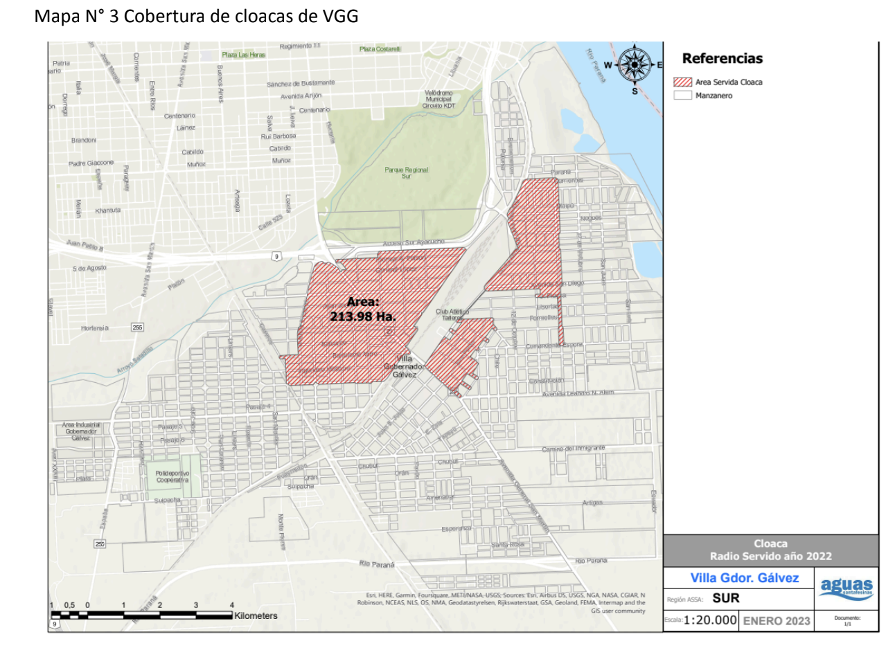

  

<h1 align="center">🏥 Análisis de Situación de Salud | Villa Gobernador Gálvez</h1>

<h2>📌 Resumen</h2>

El trabajo de análisis de datos presentado aquí se enmarca en un estudio epidemiológico de la situación de salud (<strong>A.S.I.S</strong>) de la localidad de <strong>Villa Gobernador Gálvez</strong> en Santa Fe, Argentina.

La información fue recopilada de datasets pertenecientes al <strong>Sistema Nacional de Vigilancia en Salud (S.N.V.S)</strong> y fue utilizada como base para obtener información relativa a los principales problemas de salud que aquejan a la población de esta zona.

<h2>🛠️ Skills Técnicas</h2>

El script de <strong>R</strong> presentado realiza un análisis de datos sobre consultas ambulatorias, utilizando diversas habilidades técnicas:

<ul>
  <li><strong>Carga de Datos:</strong> uso de la librería <code>readxl</code> para cargar datos desde un archivo Excel.</li>
  <li><strong>Manipulación de Datos:</strong> uso de librerías como <code>dplyr</code> y <code>tidyr</code> para manipular y transformar los datos.</li>
  <li><strong>Análisis de Datos:</strong> análisis estadísticos descriptivos, como suma total de consultas e incidencia de enfermedades.</li>
  <li><strong>Visualización de Datos:</strong> uso de <code>ggplot2</code> para crear gráficos y visualizar resultados.</li>
  <li><strong>Presentación de Resultados:</strong> uso de <code>kableExtra</code> para presentar resultados en formato tabla.</li>
</ul>

<h2>📚 Librerías Utilizadas</h2>

<ul>
  <li><code>readxl</code></li>
  <li><code>tidyverse</code> (incluyendo <code>dplyr</code>, <code>tidyr</code>, <code>ggplot2</code>, etc.)</li>
  <li><code>kableExtra</code></li>
  <li><code>knitr</code></li>
</ul>
